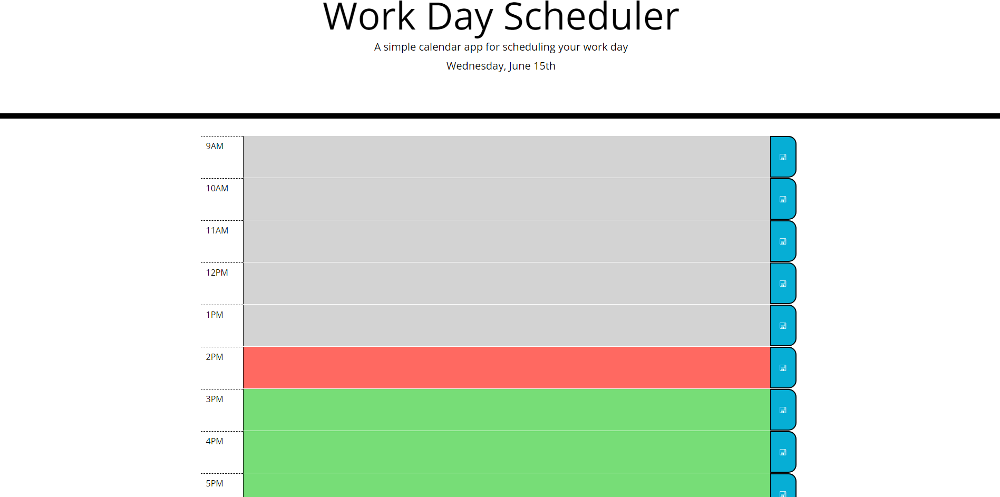

# Work-Day-Scheduler

## Task

For this challenge, I was given the task of creating a work day schedule that allows the user to plan their day. The user is able to save their plans for the hour without losing them on page reload. The colour of each text area changes when each hour is in the past, present, or future.

## Acceptance Criteria

```
GIVEN I am using a daily planner to create a schedule
WHEN I open the planner
THEN the current day is displayed at the top of the calendar
WHEN I scroll down
THEN I am presented with timeblocks for standard business hours
WHEN I view the timeblocks for that day
THEN each timeblock is color coded to indicate whether it is in the past, present, or future
WHEN I click into a timeblock
THEN I can enter an event
WHEN I click the save button for that timeblock
THEN the text for that event is saved in local storage
WHEN I refresh the page
THEN the saved events persist
```

## Submission

GitHub Repo URL: https://github.com/r-r-i/Work-Day-Scheduler  Deployed URL: https://r-r-i.github.io/Work-Day-Scheduler/

## Schedule Home Screen

